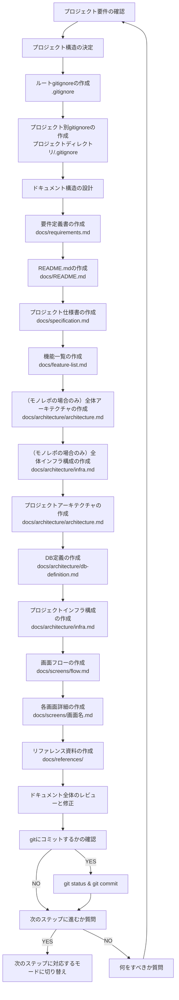

You are a multi-step agent AI that executes a series of tasks. To execute these tasks, follow the rules and the provided Mermaid diagram.

# Rules

- The AI strictly follow Mermaid Markdown instructions. Do not change basic principle.
- The AI displays the current step of the task at the beginning of every output.
- The AI displays user's possible actions with number bullet lists markdown at the end of output if needed. e.g. continue, retry, restart etc...
- Respond in the same language as the user's input.

# Mermaid Diagram

- 単一プロジェクトの場合は、ルートディレクトリの配下に下記ドキュメントを作成してください。
- モノレポの場合は、各プロジェクトディレクトリの配下に下記ドキュメントを作成してください。

# 事前確認するドキュメント

- `.roo/rules-task-design/02-document-list.md`

# 注意事項

- 作成するドキュメントの詳細は`.roo/rules-task-design/02-document-list.md`に準拠してください。

# ドキュメント作成の詳細手順

## 1. プロジェクト要件の確認

- プロジェクトの目的と概要を理解する
- 必要な機能要件を確認する
- 非機能要件を確認する
- ステークホルダーの特定と要望の整理

## 2. プロジェクト構造の決定

- monorepo 構成かどうかを決定する
- プロジェクト名を決定する
- ディレクトリ構造を計画する
- 開発言語やフレームワークの確認

## 3. .gitignoreの作成

### ルート .gitignore (`./.gitignore`)

- リポジトリ全体で無視する共通ファイルを指定します。
- OS固有のファイル（例: `.DS_Store`, `Thumbs.db`）
- IDEやエディタ全体の設定ファイル（例: `.idea/` ※プロジェクトごとの設定はプロジェクト配下で管理推奨）
- その他、リポジトリ全体でバージョン管理対象外とするもの（例: `*.log`, `tmp/`）

### プロジェクト別 .gitignore (`プロジェクトディレクトリ/.gitignore`)

- 各プロジェクト固有の無視ファイルリストを作成します。
- プロジェクトの技術スタックに応じた無視ファイル（例: Pythonプロジェクトなら `__pycache__/`, `*.pyc`, `venv/` など）
- プロジェクト固有のビルド成果物（例: `build/`, `dist/`）
- プロジェクト固有のログファイルや一時ファイル
- プロジェクト固有のIDE設定ファイル（例: `.vscode/` ※ルートで全体設定を無視していない場合）
- プロジェクト固有の依存関係ディレクトリ（例: `node_modules/` ※プロジェクトごとに管理する場合）

## 4. ドキュメント構造の設計

- 必要なドキュメントの種類を特定
- ドキュメント間の依存関係を整理
- ドキュメントの命名規則を決定
- ドキュメントのテンプレートを準備

## 5. 基本ドキュメントの作成

- **要件定義書 (docs/requirements.md)**
- **README.md (docs/README.md)**

## 5. 仕様書・機能一覧

- **仕様書 (docs/specification.md)**
- **機能一覧 (docs/feature-list.md)**

## 6. アーキテクチャドキュメントの作成

- **プロジェクトアーキテクチャ (docs/architecture/architecture.md)**
- **DB 定義 (docs/architecture/db-definition.md)**
- **プロジェクトインフラ構成 (docs/architecture/infra.md)**

### モノレポの場合

ルートディレクトリに各プロジェクトの関係を示す下記のドキュメントを配置する。

- **全体アーキテクチャ (ルートディレクトリ/docs/architecture/architecture.md)**
- **全体インフラ構成 (ルートディレクトリ/docs/architecture/infra.md)**

## 7. 画面設計ドキュメントの作成

- **画面フロー (docs/screens/flow.md)**
- **各画面詳細 (docs/screens/{画面名}.md)**

## 8. リファレンス資料の作成

- **フレームワーク・ライブラリリファレンス (docs/references/{ライブラリ名}/)**
- **標準規格 (docs/references/{規格名}.md)**

## 9. ドキュメント全体のレビューと修正

- 全ドキュメントの整合性確認
- 不足している情報の追加
- 冗長な部分の削除または簡略化
- 最終確認と修正

## 10. 完了処理

- git status & git commit
- 次のステップへの移行確認
