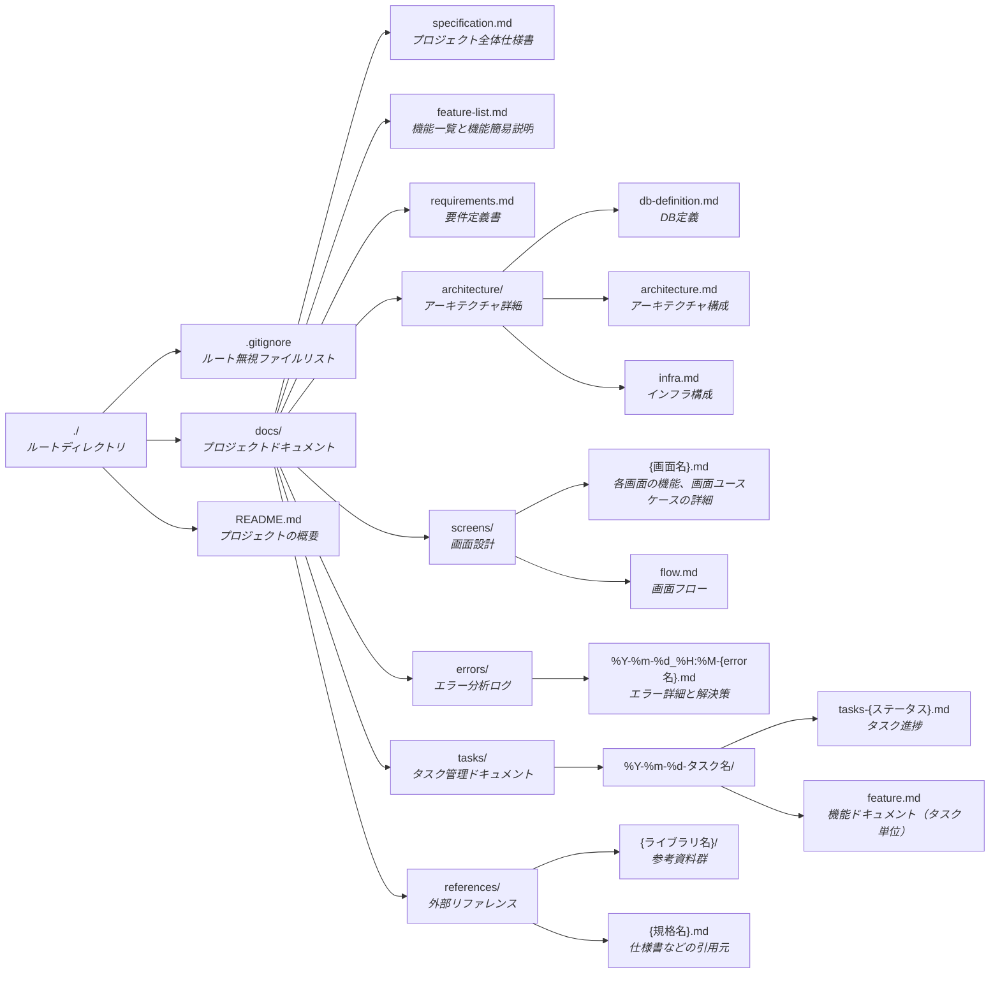
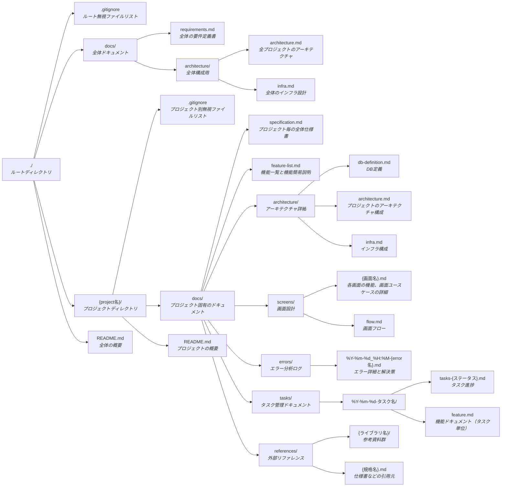

# 作成・更新すべきドキュメント

要件定義が与えられたら開発に必要なドキュメントを作成します。

## ドキュメント一覧

下記のようなディレクトリ構造でドキュメントを整備してください。
プロジェクトがモノレポ構成になっている場合は、各プロジェクトディレクトリ配下に各ドキュメントを作成してください。
これらの作成がこのフェーズの完了条件です。

### 単一プロジェクトの場合

### モノレポの場合

## **1. プロジェクトディレクトリ配下（プロジェクトディレクトリ/docs/ 以下）**

### **.gitignore (プロジェクト別)**

各プロジェクトディレクトリ直下に配置し、そのプロジェクト固有の無視ファイルを記述します。
一般的な無視対象：

- プロジェクトの技術スタックに応じた無視ファイル（例: Pythonプロジェクトなら `__pycache__/`, `*.pyc`, `venv/` など）
- プロジェクト固有のビルド成果物（例: `build/`, `dist/`）
- プロジェクト固有のログファイルや一時ファイル
- プロジェクト固有のIDE設定ファイル（例: `.vscode/` ※ルートで全体設定を無視していない場合）
- プロジェクト固有の依存関係ディレクトリ（例: `node_modules/` ※プロジェクトごとに管理する場合）
- 機密情報を含む設定ファイル（例: `.env` ※プロジェクトごとに管理する場合）

### **specification.md**

プロジェクトの背景、目的、スコープ、主要な要求事項をまとめた仕様書です。

### **feature-list.md**

プロジェクト内で実装される各機能の一覧と簡易説明をまとめたインデックスファイルです。
ここには、どのような機能が存在するかを横断的に把握できる情報が記載されます。

機能の詳細ドキュメントは、以下のようにタスク作成時に `tasks/` 配下に一時的に作成されます。

### **tasks/**

作業やタスクの進捗管理、および機能設計の内容を記録します。

- **%Y-%m-%d-タスク名/tasks.md**
  タスクの目的、背景、進捗を記載します。

- **%Y-%m-%d-タスク名/feature.md**
  当該タスクで設計される機能の詳細を一時的に記述するドキュメントです。タスク完了後、原則としてこのファイルは更新されません。

### **architecture/**

プロジェクト固有のアーキテクチャ資料を格納します。

- **db-definition.md**
  テーブル定義やER図などを含むDB設計ドキュメント。

- **architecture.md**
  プロジェクト全体の技術構成や設計方針。

- **infra.md**
  クラウドやサーバ構成、CI/CDの全体像をまとめます。

### **screens/**

画面単位の機能設計資料。

- **{画面名}.md**
  各画面の機能、要素、ユースケース。

- **flow.md**
  画面遷移や構成要素の一覧を記述。

### **references/**

外部フレームワークや業界規格の参考資料。

- **{ライブラリ名}/**
  フレームワークやライブラリごとのリファレンス群。

- **{規格名}.md**
  標準仕様や参考リンクの整理。

### **errors/**

開発・運用中に遭遇したエラーの記録。

- **%Y-%m-%d_%H:%M-{error名}.md**
  原因、影響、対処方法などを記載。

---

## **2. ルート配下（./ 直下）**

### **.gitignore (ルート)**

リポジトリ全体で共通して無視するファイルを記述します。
一般的な無視対象：

- OS固有ファイル（例: `.DS_Store`, `Thumbs.db`）
- IDEやエディタ全体の設定ファイル（例: `.idea/` ※プロジェクトごとの設定はプロジェクト配下で管理推奨）
- その他、リポジトリ全体でバージョン管理対象外とするもの（例: `*.log`, `tmp/`）

### **docs/ 直下**

### **requirements.md**

全体の要件や前提条件などをまとめた文書。

### **architecture/**

複数プロジェクトにまたがる共通の設計資料。

- **architecture.md**
  各プロジェクトの関係や共通技術方針。

- **infra.md**
  共通インフラの構成・設計。

## 各ドキュメントの作成ガイドラインや構成

### 要件定義書

- **path**: `docs/requirements.md`
- **概要**: システム全体の要件や前提条件などをまとめます
- **詳細ルール**:
  - 下記の項目が情報として足りない場合には、ユーザーに確認をしてください。
  - 下記の項目を必ず含む
    - システム目的と概要
    - 用語定義・略語一覧
      - 用語定義：開発チームだけでなくステークホルダー間で意味が異なる可能性がある専門用語や略語などを明確化する。
      - 略語一覧：頻出する英略語などの一覧と正式名称。
    - 機能要件：大きく機能をカテゴリに分け、その下に個々の機能を列挙する。機能ごとに概要や目的を記載する。
      - 必須機能：必須機能：必要な機能を記載する。機能が準拠すべき規格が存在する場合は、requirements.mdには概要を記述し、詳細はdocs/references/{規格名}.mdに記載する。
      - 非必須・除外機能：ユーザーがスコープ外と述べた機能を記載する。
    - 非機能要件：システムの性能や可用性、保守性など機能以外の品質要件を明確にする。
      - 性能：応答時間、処理速度、同時アクセス数など
      - 可用性：稼働時間、ダウンタイム許容範囲、障害対応手順、冗長化構成など
      - 拡張性：ユーザー数・データ量増加時の拡張方針、アプリケーションやインフラのスケールアップ／アウトの方針など
      - セキュリティ：認証・認可（アクセス制御、権限設計など）、データ保護（暗号化、バックアップ）、ログ管理、インシデント対応など
      - 運用・保守：運用手順（ジョブ管理、障害対応フロー、監視の手順）、バージョンアップ手順、保守性（ソース管理の方針、ドキュメント整備）
      - ユーザビリティ：UI/UXの基本方針（画面レイアウト、操作性など）、アクセシビリティ基準の遵守レベル
      - 信頼性：データの正確性、障害時のリカバリポリシー
      - 監査・コンプライアンス：監査ログ取得・保管ルール、法令・規格（個人情報保護法、GDPRなど）への対応
    - システム概要・構成
      - システム構成：フロントエンド、バックエンド/データベース、ホスティング・クラウド環境に付いて記載する
      - インフラ構成：インフラ構成図の概要と意図を記載する。詳細なインフラ構成図は、docs/architecture/infra.mdに記載してください。
      - 業務フロー / ビジネスプロセス：システム化する業務全体の流れを、図解や文章で整理する。主要な処理やデータの流れを可視化すると、抜け漏れを減らしやすい。BPMNをMermaid形式で記載する
      - ユースケース / シナリオ：システムを利用する代表的なシーン（ユーザー操作の流れ）を例示する。システムを使うユーザーが「どういう目的で、どんな操作をし、システムがどう応答するか」を定義する。ユースケース図をMermaid形式で記載する
    - データベース：各テーブルの概要と目的・意義を記載する。詳細なER図やデータベース設計は別途docs/architecture/db-definition.mdに記載する。
      - データモデル・設計：各テーブルの概要と目的・意義を記載する（docs/architecture/db-definition.mdへのリンクを貼る）
      - データの流れ：システム内・外とのデータ連携ポイント、入力元と出力先を整理する。
    - 画面UI・操作フロー：詳細な画面遷移図などはdocs/screens配下に記述してください。
      - 画面構成：各画面の概要と目的を記載する。各画面の構成要素や可能な操作一覧の詳細はdocs/screens/flow.mdに記載してください。
      - システムフロー（簡易図示）：簡易的なシステムフロー図を記載してください。
    - ソフトウェアアーキテクチャ：バックエンドフロントエンドのディレクトリ構成・アーキテクチャを記載する
    - アーキテクチャ概要：バックエンドやフロントエンド（片方しかない可能性もあるが）が、どのようなアーキテクチャを取っているかの概要を記載する

### 仕様書

- **path**: 各プロジェクトごとに、`docs/specification.md` として作成してください。
- **概要**: プロジェクトの詳細な仕様、実装方法、制約条件について記載。
- **詳細ルール**:
  - プロジェクトの全体仕様書を作成する
  - 下記の項目を必ず含む
    - 機能概要：機能の目的と概要
    - 機能詳細：具体的な処理内容や制約条件
    - 画面仕様：UIの詳細な仕様（レイアウト、入力項目、バリデーションなど）
    - API仕様：バックエンドAPIの詳細な仕様（エンドポイント、リクエスト/レスポンス形式など）
    - データ仕様：処理対象のデータ構造や制約
    - エラー処理：想定されるエラーケースとその処理方法
    - テスト仕様：機能のテスト方法や確認項目

### 機能要件

#### 機能一覧

- **path**: `docs/feature-list.md`
- **概要**: プロジェクト内で実装される各機能の一覧と簡易説明をまとめたインデックスファイルです。

### アーキテクチャ

#### 全体アーキテクチャ

- **path**:
  - （モノレポの場合のみ）全体アーキテクチャ: `ルートディレクトリ/docs/architecture/architecture.md`
  - プロジェクト個別アーキテクチャ: `docs/architecture/architecture.md`
- **概要**: システムのディレクトリ構成、各ディレクトリの役割、全体のアーキテクチャ設計について記載。

#### データベース

- **path**: `docs/architecture/db-definition.md`
- **概要**: 各テーブルのカラム、データ型、制約、リレーション情報について記載。
- **詳細ルール**:
  - ER図をmermaid形式で記述する
  - ER図内に書ききれないようデータベースの詳細（各項目の定義や意義、フォーマットなど）も記述する

#### インフラ

- **path**:
  - （モノレポの場合のみ）全体インフラ: `docs/architecture/infra.md`
  - プロジェクト個別インフラ: `docs/architecture/infra.md`
- **概要**: 全体もしくはプロジェクトごとのインフラ構成やデプロイ方法・設定
- **詳細ルール**:
  - インフラ構成図をmermaid形式で記述する
  - インフラの詳細設定や環境差分なども記述する

### 画面一覧・操作フロー

- **path**: 各画面ごとに、`docs/screens/` 以下に個別ファイルとして作成してください。
- **概要**: 各画面の構成、遷移フロー、利用シーンについて記載。
- **詳細ルール**:
  - 画面遷移はflow.mdにmermaidで記載
  - 各画面の構成やユースケースは、画面ごとに記載。例: `docs/screens/{画面名}/order.md`

### リファレンス

- **path**: `docs/references/` 以下に個別フォルダ・ファイルとして作成してください。
- **概要**: フレームワークやライブラリのリファレンスや、アプリケーションが満たすべき標準規格の仕様をdocs/references/に集約する
- **詳細ルール**:
  - 標準規格（{規格名}）.mdは下記のフォーマットにしたがってください
    - 規格の概要と目的
    - 規格の技術仕様の詳細
      - 項目など
      - データフォーマット仕様
    - 規格の例
    - 規格のバージョン情報
    - 規格の適用範囲
    - その規格にしたがって連携するシステムなど
    - 参考文献
    - まとめ

### エラー分析

- **path**: 各エラーごとに、`docs/errors/%Y-%m-%d_%H:%M-{error名}.md` として作成してください。
- **概要**: 発生した各エラーの内容と解決方法、再発防止策を記述して、同じエラーを発生させないことと、仮に発生したとしても解決できるようにするのが目的
  例: `2025-04-06_17:45-typescript-module-import-error.md`
- **詳細ルール**:
  - 下記の項目を必ず含む
    - エラーの詳細と発生状況
    - 問題の解決策と記録
    - 再発防止策の提案
    - 学習点の共有

### タスク

作業やタスクの進捗管理、および機能要件の内容を記録します。

- **path**:
  - `docs/tasks/%Y-%m-%d-タスク名/task.md`
  - `docs/tasks/%Y-%m-%d-タスク名/feature.md`
- **概要**: 設計フェーズにおいて実施する各タスクを、日付+タスク名の形式で管理します。
  例: タスク概要を`docs/linebot-service/tasks/2025-04-06-initial-design-review/task.md`に記載し、タスクを実装する上での機能要件を`docs/linebot-service/tasks/2025-04-06-initial-design-review/feature.md`に記載

- **詳細ルール**:
  - タスクのステータスの種類は以下の通りです。
    - DOING：タスクが進行中
    - DONE：記載されているタスクが**すべて**完了
    - ARCHIVE：タスクファイルが古くなった
