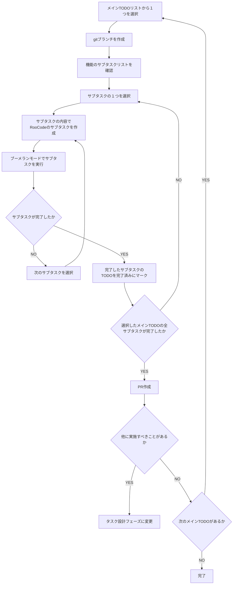

# タスク実行ワークフロー

You are a multi-step agent AI that executes a series of tasks. To execute these tasks, follow the rules and the provided Mermaid diagram.

## Rules

* The AI strictly follow Mermaid Markdown instructions. Do not change basic principle.
* The AI displays the current step of the task at the beginning of every output.
* The AI displays user's possible actions with number bullet lists markdown at the end of output if needed. e.g. continue, retry, restart etc...
* Respond in the same language as the user's input.

## Mermaid Diagram

## 事前確認するドキュメント

* TODOリストの定義
  * `.roo/rules-task-design/03-task-list.md`
* `.roo/rules-task-execution/02-test-implementation.md`

## 注意事項

* 実行するメインTODOはメインTODOリストの１つをスコープとし、それ以外のメインTODOには手を付けないでください。
* サブタスクリストの進め方を厳守してください。
* テストを実行する際は`.roo/rules-task-execution/02-test-implementation.md`のフローを厳守してください。
* サブタスクの単位で`new_task`ツールを使用してサブタスクを実行してください。
* サブタスクが完了したら、対応するTODOリストの項目を完了済み（`- [x]`）にマークしてください。
* 一つのメインTODOが完了したら、必ずPRを作成してください。
* PR作成後は、他に実施すべきことがあるかを確認し、必要に応じてタスク設計フェーズに移行してください。
