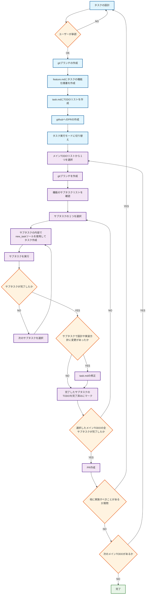

# Roo Code Rules

このリポジトリは、VSCode拡張機能であるRoo Codeのルール（プロンプト）を共通管理するためのリポジトリです。複数のプロジェクトで一貫したAIアシスタントの動作を実現するために、ルールファイルを一元管理し、各プロジェクトに自動同期する仕組みを提供します。

## 開発フロー

タスク設計モードとタスク実行モードを組み合わせた開発フローは以下の通りです：



### フェーズ説明

**タスク設計フェーズ（水色）**
- タスクの要件定義と設計
- ユーザーによる承認プロセス
- 機能仕様書とTODOリストの作成

**タスク実行フェーズ（紫色）**
- TODOリストに基づく段階的な実装
- サブタスクの専門モードへの委譲
- 設計変更の反映とドキュメント更新

**判断ポイント（オレンジ色）**
- ユーザー承認、完了確認、継続判断

**完了（緑色）**
- 全タスクの完了

## 概要

このリポジトリでは、以下のファイルとディレクトリを管理しています：

- `.roomodes` - Rooのカスタムモード定義
- `.roo/` - roo codeのルール定義

## 同期の仕組み

このリポジトリのルールファイルは、GitHub Actionsワークフローを使用して他のリポジトリに自動同期されます。

### 同期プロセス

1. `rules-updated`イベントが発生するか、手動でワークフローがトリガーされる
2. ターゲットリポジトリと`roo-code-rules`リポジトリがチェックアウトされる
3. Makefileを使用してルールファイルとディレクトリがターゲットリポジトリにコピーされる
4. 変更がPRとして作成される

### 同期対象

- `.roomodes`
- `.roo/`

## 使用方法

### 基本的な使用方法

1. エディタを開いたルートディレクトリに以下のファイルとディレクトリを配置します：
   - `.roomodes`
   - `.roo/`
2. Roo Codeを起動すると、配置したルールとカスタムモードが適用されます

### モノレポ運用の場合

1. このリポジトリをクローンします
2. このリポジトリのルートに`projects`ディレクトリを作成します
```
mkdir projects
```
3. 必要なリポジトリを`projects`ディレクトリ内にクローンします
4. Roo Codeを起動すると、配置したルールとカスタムモードが適用されます
